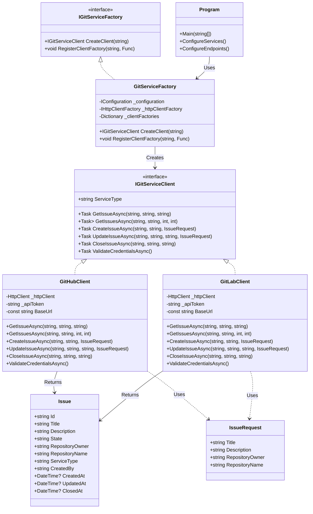
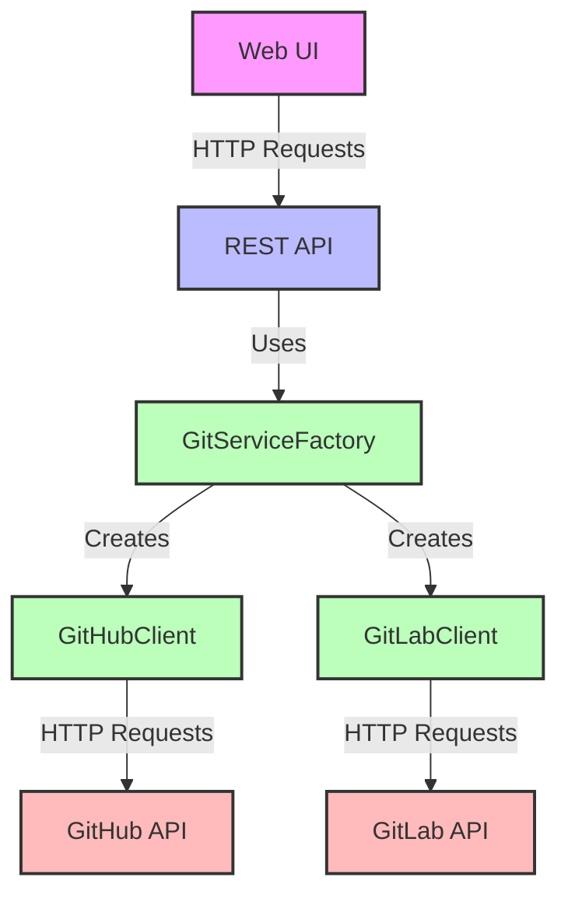

# GitIssueManager

A unified application for managing issues across multiple Git hosting platforms, implemented with clean architecture principles and extensible design patterns.

## 📋 Project Overview

GitIssueManager provides a unified interface for managing issues across different Git hosting services (currently GitHub and GitLab). The application follows clean architecture principles with a clear separation of concerns, making it maintainable, testable, and easily extensible to support additional Git services in the future.

## 🏛️ Architecture

The solution is organized into three main projects:

```
GitIssueManager/
├── GitIssueManager.Api/       # ASP.NET Core Web API and static web UI
├── GitIssueManager.Core/      # Core domain models, interfaces, and services
└── GitIssueManager.Tests/     # Unit, integration, and functional tests
```

### 1. `GitIssueManager.Api`

**Purpose:** Hosts the REST API endpoints and serves a static web UI.

**Key components:**
- `Program.cs`: Configures services, middleware, and API endpoints using Minimal API syntax
- `wwwroot/index.html`: Bootstrap-based UI for interacting with the API
- `appsettings.json`: Configuration including API tokens for Git services

### 2. `GitIssueManager.Core`

**Purpose:** Contains domain models, interfaces, and services that implement the application's core logic.

**Key components:**
- Domain Models: `Issue` and `IssueRequest` classes
- Interfaces: `IGitServiceClient` and `IGitServiceFactory` 
- Implementations: `GitHubClient`, `GitLabClient`, and `GitServiceFactory`
- Utilities: `JsonHelper` for processing API responses

### 3. `GitIssueManager.Tests`

**Purpose:** Contains automated tests for all components.

**Key components:**
- Unit Tests: Testing individual components in isolation
- Integration Tests: Testing the interaction between components
- Functional Tests: Testing the API endpoints

## 💡 Design Patterns

### Factory Pattern

The Factory Pattern is used to create Git service clients without exposing the creation logic:

```csharp
// Factory interface
public interface IGitServiceFactory
{
    IGitServiceClient CreateClient(string serviceType);
    void RegisterClientFactory(string serviceType, Func<IConfiguration, IHttpClientFactory, IGitServiceClient> factory);
}

// Factory implementation
public class GitServiceFactory : IGitServiceFactory
{
    // Implementation details...
}
```

**Benefits:**
- Decouples client creation from client usage
- Allows for easy extension to support new Git services (e.g., Bitbucket)
- Centralizes configuration and client setup

### Strategy Pattern

The Strategy Pattern is used for different issue management implementations:

```csharp
// Strategy interface
public interface IGitServiceClient
{
    Task<Issue> GetIssueAsync(string repositoryOwner, string repositoryName, string issueId);
    Task<List<Issue>> GetIssuesAsync(string repositoryOwner, string repositoryName, int page = 1, int perPage = 30);
    Task<Issue> CreateIssueAsync(string repositoryOwner, string repositoryName, IssueRequest issueRequest);
    Task<Issue> UpdateIssueAsync(string repositoryOwner, string repositoryName, string issueId, IssueRequest issueRequest);
    Task<Issue> CloseIssueAsync(string repositoryOwner, string repositoryName, string issueId);
    Task<bool> ValidateCredentialsAsync();
    string ServiceType { get; }
}

// Concrete strategies
public class GitHubClient : IGitServiceClient { /* Implementation */ }
public class GitLabClient : IGitServiceClient { /* Implementation */ }
```

**Benefits:**
- Encapsulates different Git service API behaviors
- Allows for a consistent interface across different providers
- Facilitates testing through substitution

### Dependency Injection

Dependency Injection is used throughout the application:

```csharp
// Service registration
builder.Services.AddSingleton<GitServiceFactory>(provider => {
    // Factory setup...
});
builder.Services.AddSingleton<IGitServiceFactory>(provider => 
    provider.GetRequiredService<GitServiceFactory>());

// Usage in API endpoints
app.MapGet("/api/services/{service}/repos/{repositoryOwner}/{repositoryName}/issues", 
    async (string service, string repositoryOwner, string repositoryName, 
           GitServiceFactory factory, ILogger<Program> logger, /* other parameters */) => 
    {
        // Use the factory to get the appropriate client
        var client = factory.CreateClient(service);
        // Use the client
    });
```

**Benefits:**
- Decouples components, improving testability
- Centralizes service configuration
- Simplifies component substitution for different environments

### Repository Pattern (Modified)

A modified Repository Pattern is used to abstract data access:

```csharp
// GitServiceClient implementations act as repositories for issues
public class GitHubClient : IGitServiceClient
{
    public async Task<List<Issue>> GetIssuesAsync(string owner, string repository, int page = 1, int perPage = 30)
    {
        // Implementation that accesses GitHub API
    }
    
    // Other methods...
}
```

**Benefits:**
- Abstracts API-specific implementation details
- Provides a consistent domain model regardless of data source
- Simplifies testing through mocking

## 📊 Architecture Diagrams

### Class Diagram



### Component Diagram



## 🔄 Request Flow

1. **User Interaction**: User interacts with the web UI or directly with the API endpoints
2. **API Endpoint**: API endpoint receives the request and validates input
3. **Service Factory**: `GitServiceFactory` creates the appropriate client based on the service type
4. **Service Client**: `IGitServiceClient` implementation (GitHub or GitLab) processes the request
5. **HTTP Request**: Client sends HTTP request to the appropriate Git hosting service API
6. **Response Processing**: Client processes the API response and maps it to domain model
7. **Response**: API endpoint returns the result to the user

## 🛠️ API Endpoints

| Method | Endpoint | Description |
|--------|----------|-------------|
| GET | `/api/services/{service}/repos/{repositoryOwner}/{repositoryName}/issues` | Get issues for a repository |
| GET | `/api/services/{service}/repos/{repositoryOwner}/{repositoryName}/issues/{issueNumber}` | Get a specific issue |
| POST | `/api/services/{service}/repos/{repositoryOwner}/{repositoryName}/issues` | Create a new issue |
| PUT | `/api/services/{service}/repos/{repositoryOwner}/{repositoryName}/issues/{issueNumber}` | Update an existing issue |
| POST | `/api/services/{service}/repos/{repositoryOwner}/{repositoryName}/issues/{issueNumber}/close` | Close an issue |
| GET | `/api/services/{service}/validate` | Validate credentials for a service |

## 🧪 Testing

- **Unit Tests**: Test individual components in isolation with mocked dependencies
- **Integration Tests**: Test interaction between components
- **Functional Tests**: Test the API endpoints in a simulated environment

## 📋 Task Requirements Coverage

The implementation meets all the requirements specified in the task:

1. ✅ **Support for Multiple Git Services**:
   - Implemented GitHub and GitLab services
   - Architecture allows for easy addition of Bitbucket in the future

2. ✅ **Issue Management Features**:
   - Adding new issues (with title and description)
   - Modifying issue's title and description
   - Closing issues

3. ✅ **Application Structure**:
   - Core library that handles application logic (`GitIssueManager.Core`)
   - REST API that provides endpoints for the required functionalities (`GitIssueManager.Api`)

4. ✅ **Technical Requirements**:
   - All requests to Git hosting services are sent directly using HttpClient
   - No third-party libraries for GitHub/GitLab API communication
   - Uses JSON handling through System.Text.Json for processing responses

## 🔄 Adding a New Git Service (e.g., Bitbucket)

To add support for Bitbucket:

1. **Create a Bitbucket Client**:
   ```csharp
   public class BitbucketClient : IGitServiceClient
   {
       // Implement the interface methods for Bitbucket
   }
   ```

2. **Register the Client in the Factory**:
   ```csharp
   factory.RegisterClientFactory("bitbucket", (config, httpFactory) =>
   {
       var client = httpFactory.CreateClient("Bitbucket");
       // Configure client
       var apiToken = config["Bitbucket:ApiToken"];
       // Set up headers, etc.
       return new BitbucketClient(client, apiToken);
   });
   ```

3. **Update Configuration** to include Bitbucket API token:
   ```json
   {
     "Bitbucket": {
       "ApiToken": "your-bitbucket-token-here"
     }
   }
   ```

No changes would be needed to the API endpoints or UI, as they are already designed to work with any service type that implements `IGitServiceClient`.

## 🔒 Security Considerations

- API tokens for Git services are stored in `appsettings.json` and can be overridden with environment variables or user secrets
- Token values are not exposed in API responses
- Input validation is performed on all API endpoints
- Error handling includes appropriate HTTP status codes and error messages

## 🚀 Future Improvements

- Add authentication and authorization for the API
- Implement caching to reduce API calls to Git services
- Add support for additional issue features (labels, assignees, etc.)
- Implement a more sophisticated UI with filtering and sorting options
- Add support for webhooks to receive real-time updates from Git services